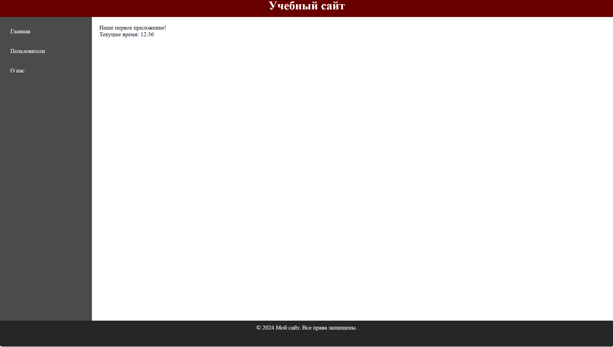
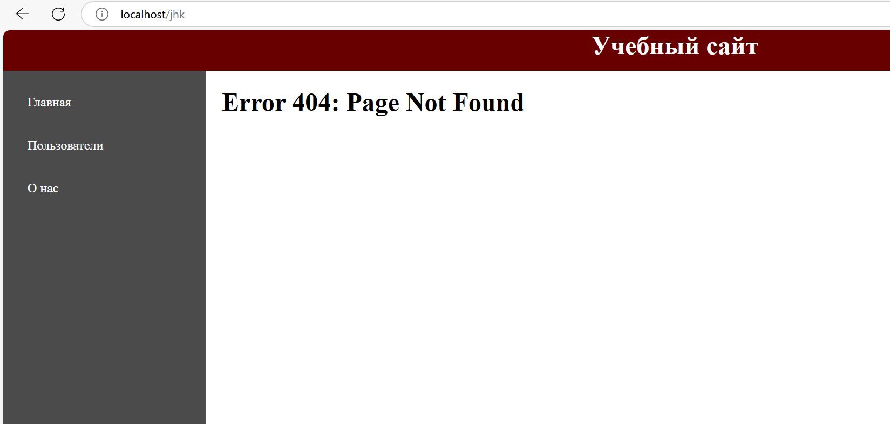
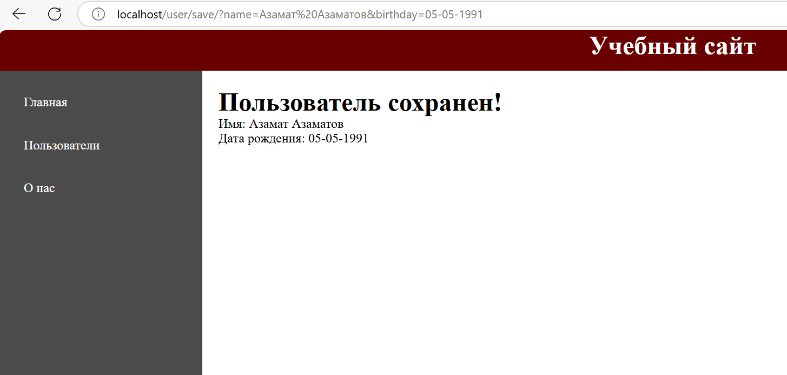

# Домашняя работа
1. Добавьте к шаблону подключение файлов стилей так, чтобы в дальнейшем можно было дорабатывать внешний вид системы.

`В папке src создаем папку styles и внутри создаем файл style.css
В main.twig в теги head добавляем запись "<link rel="stylesheet" href="/src/styles/style.css>"`

2. Сформируйте еще три подключаемых к скелету блока – шапку сайта (она всегда будет одинаковой по стилю и располагаться в самой верхней части), подвал сайта (также одинаковый, но в нижней части) и sidebar (боковая колонка, которую можно наполнять новыми элементами).


3. Средствами TWIG выводите на экран текущее время.
```Добавил запись в page-index.twig `<p>Текущее время: {{ "now"|date("H:i") }}</p>```

4. Создайте обработку страницы ошибки. Например, если контроллер на найден, то нужно вызывать специальный метод рендеринга, который сформирует специальную страницу ошибок.
Для страницы ошибок формируйте HTTP-ответ 404. Это можно сделать при помощи функции header.


`Создал страницу page-error.twig и добавил функцию renderErrorPage в Application` 

5. Реализуйте функционал сохранения пользователя в хранилище. Сохранение будет происходить при помощи GET-запроса.

/user/save/?name=Иван&birthday=05-05-1991



`Создал класс UserStorage.php для хранение пользователей, добавил функцию actionSave в UserController для обработки GET запроса и сохранении пользователя`